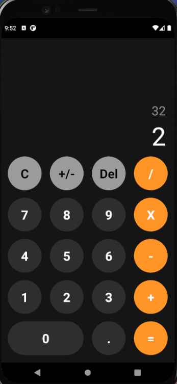

# App Calculadora / Calculation 3000 PRO TECSAS INSTRUMENT

- Proyecto de prueba con react native, una calculadora similar a la que viene en iphone
- Puedes sumar (+) restar (-) multiplicar (x) y dividir (/) como nunca!

Snaps:
1. Screen:

  

This examples are part from the [React Native: Aplicaciones nativas para IOS y Android course](https://www.udemy.com/course/react-native-fh/)